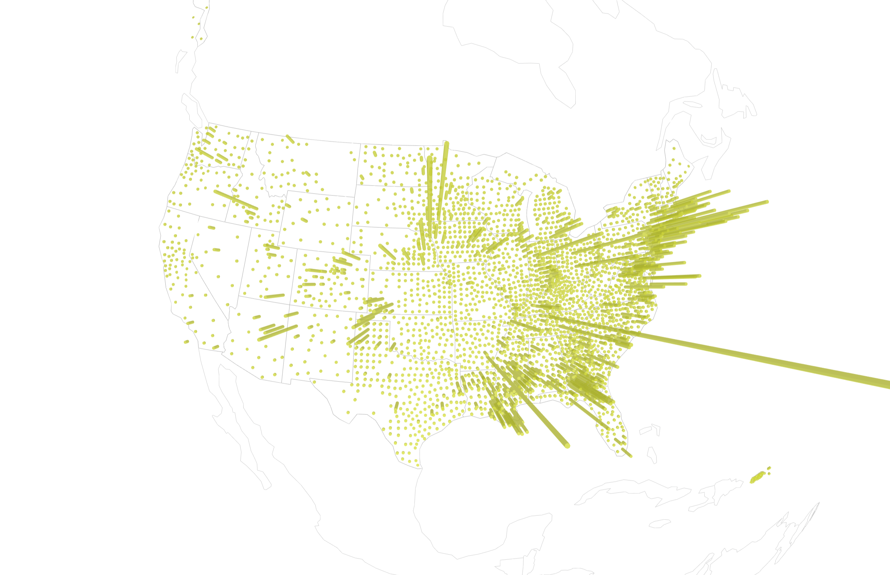

# Chronicle

Chronicle is a 3D data visualization showcasing the spread of the coronavirus in the United States. Here you can find the code for it.

## Code structure

As the names suggest, `front` contains the front-end code for the page (bootstrapped using Create React App), and `back` contains the back-end code (bootstrapped as an Express app). The back end is responsible for fetching, processing, and caching new data, before it is served to the front end.

### Technologies & libraries

**The front end uses:**
 - HTML, CSS, JavaScript
 - [React](https://reactjs.org/)
 - [Three.js](https://threejs.org/) for 3D visualization
 - [GSAP](https://greensock.com/gsap/) (specifically [ScrollTrigger](https://greensock.com/scrolltrigger/)) for scroll-based animations

**The back end uses:**
  - Node.js
  - [Express](https://expressjs.com/)

### Data fetching

Chronicle uses data from [the New York Times' public coronavirus dataset](https://github.com/nytimes/covid-19-data). The back end fetches new data every 24 hours. Incoming data is restructured for optimized delivery and processing in the front end (see `back/utils/fetch-covid-data.js`).

## Local development

To run Chronicle in your local machine:
 - Run `npm start`, or better, `nodemon` from `back`. The back-end will use port `:8080`.
 - Wait a few seconds as the backend fetches new data.
 - Run `npm start` from `front`. The front-end will be available from `http://localhost:3000`.
